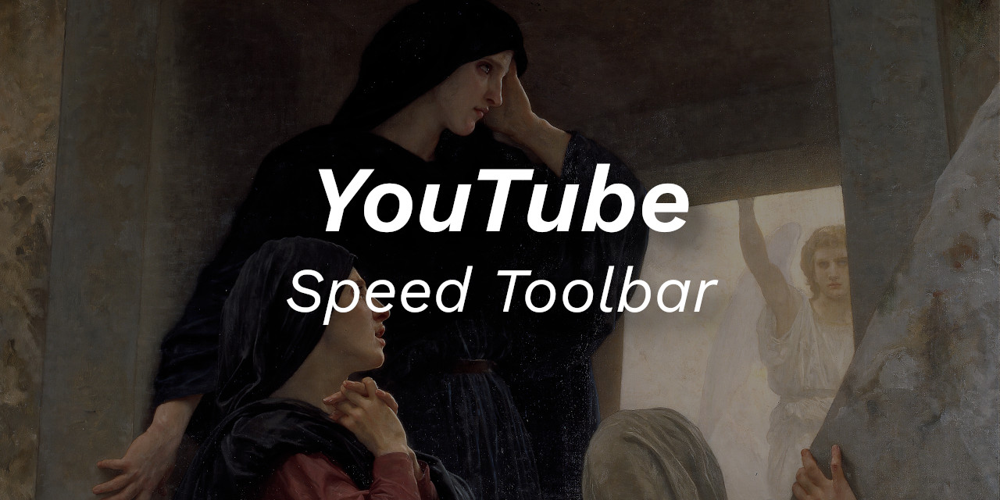

 

    
      
    
    
    
    
    
    

 

Language: <a href="readme.md">EN-US</a>

Para melhorar minha experiência de navegação no YouTube, eu criei esta barrinha de controle da velocidade dos vídeos.

Desta maneira não preciso ficar acessando as configurações no player do vídeo, basta eu clicar na barrinha (ela fica flutuando na lateral da página, de maneira bem discreta).

 
 

:smiley: Autor
---

Patrocinar: [melchisedech333](https://github.com/sponsors/melchisedech333) 
YouTube: [Melchisedech](https://www.youtube.com/channel/UC4Sh4wxncr5arnydpUfWPKw) 
Twitter: [Melchisedech333](https://twitter.com/Melchisedech333) 
Blog: [melchisedech333.github.io](https://melchisedech333.github.io/) 
LinkedIn: [Melchisedech Rex](https://www.linkedin.com/in/melchisedech-rex-724152235/)

 

:scroll: Licença
---

[ BSD-3-Clause license](./license)

  

## Lembre-se de deixar   uma linda estrelinha :star_struck:

